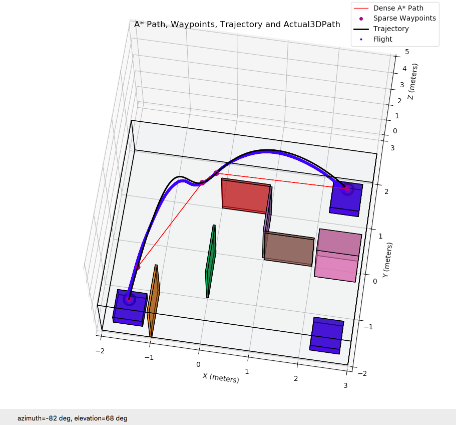
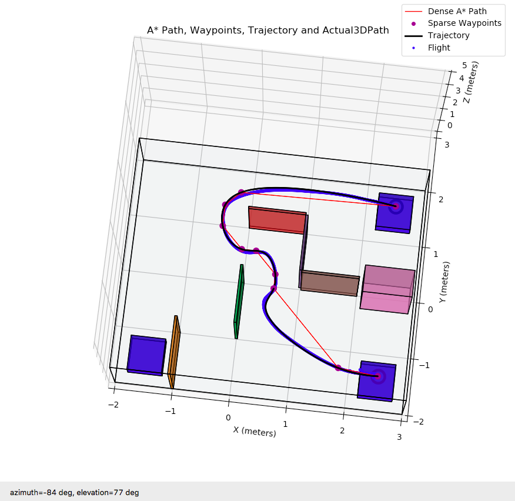
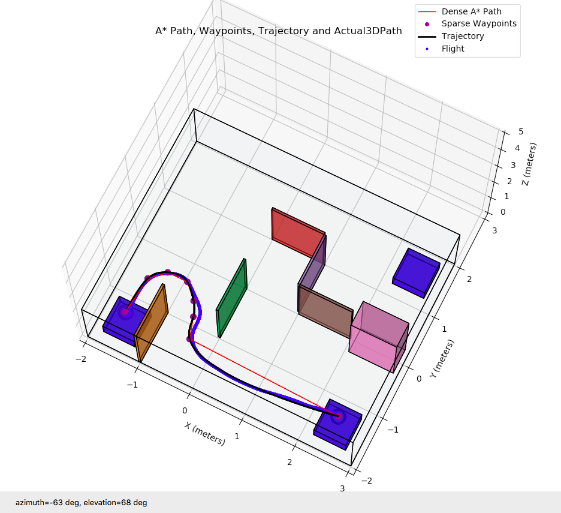

# Quadrotor
- This project includes 3 main parts: control, graph search, min-jerk trajectory design. All of them are written in python.
- Control part is implementing papers: “Minimum snap trajectory generation and control for quadrotors” from D. Mellinger and V. Kumar, and "Geometric tracking control of a quadrotor uav on SE(3)" from T. Lee, M. Leok, and N. McClamroch.
- graph search part uses Dijkstra and A* algorithm (implemented 2, but choose 1 to use) to generate collision free way points.
- trajectory is minimum-jerk(5th order), it generates the actual path for quadrotors using the pruned way-points.
- lab results:
1. control test: fly a 1m cube

2. maze tests: fly from start to end point inside a maze, use graph search and min-jerk trajectory design. Here is the lab test video:

  - 
  
Also, the actual trajectory is recorded and compared to the planned trajectory. The actual trajectory is in blue line, generated minimum jerk trajectory is in black line, original A* path is in red line.

  - 

  - 

  - 
